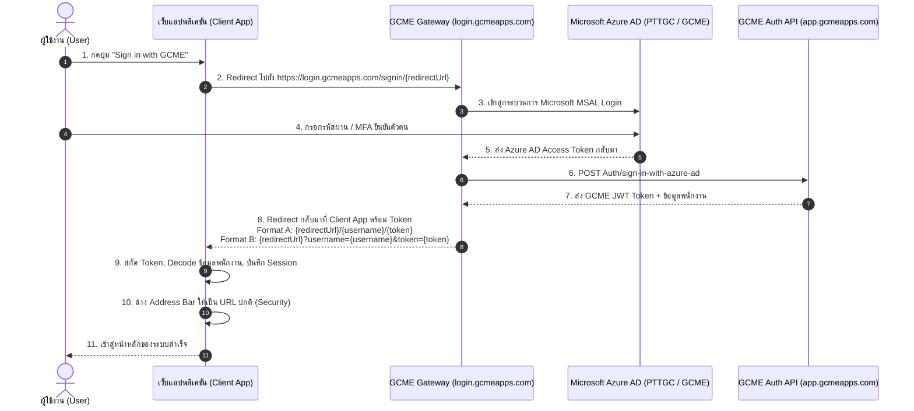

# คู่มือการเชื่อมต่อระบบเข้าสู่ระบบ GCME SSO (GCME Single Sign-On Integration Guide)

เอกสารฉบับนี้จัดทำขึ้นเพื่อเป็นคู่มือมาตรฐานสำหรับนักพัฒนาในการพัฒนาระบบ Authentication เชื่อมต่อกับ **GCME Login Gateway (`https://login.gcmeapps.com/`)** เพื่อให้สามารถนำไปประยุกต์ใช้กับเว็บแอปพลิเคชันอื่น ๆ ในเครือ GCME / PTTGC ได้อย่างรวดเร็วและถูกต้อง

---

## 1. ภาพรวมสถาปัตยกรรม (Architecture & Flow)

ระบบ GCME SSO Gateway เป็นบริการยืนยันตัวตนกลาง (Centralized Authentication Gateway) พัฒนาด้วย Angular และเชื่อมโยงกับ Microsoft Azure AD ขององค์กร (Tenant ID: `dc6df0e3-1692-4482-aa55-729e0a5e8361`) โดยมี backend API รองรับที่ `https://app.gcmeapps.com/api-azuread-login/api/`



---

## 2. ข้อกำหนดทางเทคนิค (Protocol Specifications)

### 2.1 การส่งผู้ใช้ไปล็อกอิน (Initiating Login)
ในการส่งผู้ใช้ไปล็อกอิน ให้ทำการ Redirect เบราว์เซอร์ไปยัง URL รูปแบบ:

```http
GET https://login.gcmeapps.com/signin/{ENCODED_REDIRECT_URL}
```

* **ข้อควรระวังสำคัญ:** ตัวแปร `redirectUrl` **ต้องไม่มีเครื่องหมาย slash (`/`) ปิดท้าย** เพราะระบบของ Gateway จะนำไปต่อสตริงด้วย `+ "/" + username + "/" + token` หากมี slash ปิดท้ายจะกลายเป็น `//username/token` ซึ่งทำให้ routing ผิดพลาด

**ตัวอย่าง (แบบปกติ):**
```typescript
const origin = window.location.origin;       // เช่น https://myapp.gcmeapps.com หรือ http://localhost:3000
const basePath = '/epopm';                   // หรือ path ย่อยของแอปคุณ (ถ้ามี)
const redirectUrl = `${origin}${basePath}`.replace(/\/+$/, '');

const loginUrl = `https://login.gcmeapps.com/signin/${encodeURIComponent(redirectUrl)}`;
window.location.href = loginUrl;
```

**💡 เคล็ดลับกรณี Server ไม่มีสิทธิ์แก้ Nginx (บังคับส่งกลับเป็น Query String เพื่อเลี่ยง 404):**
หาก Web Server ปลายทางไม่มีการตั้งค่า SPA Rewrite (`try_files`) และไม่สามารถเข้าถึง SSH ได้ ให้ใส่พารามิเตอร์ `?auth=mspro` ต่อท้าย Path:
```typescript
// การใส่ ?auth=mspro จะทำให้ GCME Gateway สลับไปใช้ Query String Format (?username=...&token=...)
// ซึ่งช่วยเลี่ยงปัญหา Nginx 404 ทันที 100% โดยไม่ต้องแก้ Server config
const redirectUrl = `${origin}/epopm/?auth=mspro`;
```

---

### 2.2 การรับข้อมูลกลับ (Callback Handling)
เมื่อผู้ใช้ล็อกอินสำเร็จ GCME Gateway จะส่งผู้ใช้กลับมาที่แอปพลิเคชัน โดยมีโอกาสส่งกลับมาใน **2 รูปแบบ** (ขึ้นอยู่กับเส้นทางของ Gateway):

| รูปแบบ | URL ตัวอย่าง | คำอธิบาย |
| :--- | :--- | :--- |
| **Path Format (หลัก)** | `https://myapp.com/epopm/26004950/eyJhbGciOi...` | ส่งต่อท้าย Path เป็น `/{username}/{token}` |
| **Query Format (รอง)** | `https://myapp.com/epopm/?username=26004950&token=eyJhbGciOi...` | ส่งมาเป็น Query parameter `?token=...` |

> **ข้อแนะนำ:** แอปพลิเคชันปลายทางต้องเขียนฟังก์ชันตรวจสอบและรองรับทั้ง 2 รูปแบบเสมอ

---

### 2.3 โครงสร้างของ GCME JWT Token
Token ที่ส่งกลับมาเป็น **JSON Web Token (JWT)** มาตรฐาน ประกอบด้วย 3 ส่วน (`header.payload.signature`) ในส่วนของ `payload` จะประกอบด้วยข้อมูลสำคัญ เช่น:

```json
{
  "sub": "26004950",
  "email": "26004950@pttgcgroup.com",
  "name": "นายสมชาย ใจดี",
  "unique_name": "26004950@pttgcgroup.com",
  "upn": "26004950@pttgcgroup.com",
  "department": "Engineering & Maintenance",
  "jobTitle": "Senior Engineer",
  "role": ["User"],
  "exp": 1790933660
}
```

---

## 3. ขั้นตอนการสร้าง Service ในแอปพลิเคชัน (Implementation Steps)

### ขั้นตอนที่ 1: สร้างไฟล์ `gcmeAuthService.ts`
สร้างไฟล์บริการเพื่อจัดการ Login, Token Parsing, และ Session ดังนี้:

```typescript
/**
 * gcmeAuthService.ts
 * บริการยืนยันตัวตนผ่าน GCME SSO Gateway (https://login.gcmeapps.com/)
 */

export const GCME_SSO_CONFIG = {
  baseUrl: 'https://login.gcmeapps.com',
  defaultDomain: 'pttgcgroup.com',
  tokenKey: 'gcme_access_token',
  userKey: 'gcme_user',
} as const;

export interface GCMEUserInfo {
  sub: string;
  email: string;
  name: string;
  username?: string;
  department?: string;
  jobTitle?: string;
  roles?: string[];
  rawPayload?: Record<string, any>;
}

export interface GCMECallbackResult {
  token: string;
  username?: string;
  userInfo: GCMEUserInfo;
}

/**
 * 1. ส่งผู้ใช้ไปล็อกอินที่ GCME Portal
 */
export const initiateGCMELogin = (baseAppPath: string = '/'): void => {
  const origin = window.location.origin;
  const cleanPath = baseAppPath.startsWith('/') ? baseAppPath : `/${baseAppPath}`;
  const redirectUrl = `${origin}${cleanPath}`.replace(/\/+$/, '');

  const targetUrl = `${GCME_SSO_CONFIG.baseUrl}/signin/${encodeURIComponent(redirectUrl)}`;
  window.location.href = targetUrl;
};

/**
 * ถอดรหัส Base64URL อย่างปลอดภัย (รองรับ UTF-8 ภาษาไทย)
 */
const base64UrlDecode = (str: string): string => {
  let base64 = str.replace(/-/g, '+').replace(/_/g, '/');
  while (base64.length % 4 !== 0) base64 += '=';
  try {
    const binary = atob(base64);
    const bytes = Uint8Array.from(binary, (c) => c.charCodeAt(0));
    return new TextDecoder().decode(bytes);
  } catch {
    return atob(base64);
  }
};

/**
 * 2. ถอดรหัสข้อมูลจาก JWT Token
 */
export const decodeGCMEToken = (token: string, fallbackUsername?: string): GCMEUserInfo => {
  let payload: Record<string, any> = {};

  try {
    const parts = token.split('.');
    if (parts.length >= 2) {
      payload = JSON.parse(base64UrlDecode(parts[1]));
    }
  } catch (err) {
    console.warn('[GCME SSO] Failed to decode JWT payload:', err);
  }

  // ดึง email จาก claim ต่าง ๆ
  const emailClaim =
    payload.email ||
    payload.upn ||
    payload.unique_name ||
    payload.preferred_username ||
    payload['http://schemas.xmlsoap.org/ws/2005/05/identity/claims/emailaddress'] ||
    (fallbackUsername ? `${fallbackUsername.toLowerCase()}@${GCME_SSO_CONFIG.defaultDomain}` : '');

  // ดึงชื่อ
  const nameClaim =
    payload.name ||
    payload.displayName ||
    payload['http://schemas.xmlsoap.org/ws/2005/05/identity/claims/name'] ||
    fallbackUsername ||
    emailClaim ||
    'GCME User';

  // ดึง ID
  const subClaim =
    payload.sub ||
    payload.oid ||
    fallbackUsername ||
    String(emailClaim).replace(/[^a-zA-Z0-9]/g, '_');

  return {
    sub: String(subClaim),
    email: String(emailClaim).toLowerCase().trim(),
    name: String(nameClaim).trim(),
    username: fallbackUsername || payload.onPremisesSamAccountName,
    department: payload.department,
    jobTitle: payload.jobTitle,
    roles: Array.isArray(payload.role || payload.roles)
      ? payload.role || payload.roles
      : payload.role
      ? [payload.role]
      : [],
    rawPayload: payload,
  };
};

/**
 * 3. ตรวจจับข้อมูลเมื่อถูก Redirect กลับมา
 */
export const extractGCMECallback = (baseAppSlug: string = 'epopm'): GCMECallbackResult | null => {
  if (typeof window === 'undefined') return null;

  // แบบที่ 1: ตรวจจาก Query parameters (?token=... & username=...)
  const params = new URLSearchParams(window.location.search);
  const queryToken = params.get('token');
  const queryUsername = params.get('username') || undefined;

  if (queryToken && queryToken.trim().length > 10) {
    const userInfo = decodeGCMEToken(queryToken, queryUsername);
    return { token: queryToken, username: queryUsername, userInfo };
  }

  // แบบที่ 2: ตรวจจาก Path segments (/{baseAppSlug}/{username}/{token})
  const segments = window.location.pathname.split('/').filter(Boolean);
  const appIndex = segments.indexOf(baseAppSlug);
  const remaining = appIndex !== -1 ? segments.slice(appIndex + 1) : segments;

  if (remaining.length >= 2) {
    const username = decodeURIComponent(remaining[0]);
    const token = remaining[1];
    if (token && token.length > 10) {
      const userInfo = decodeGCMEToken(token, username);
      return { token, username, userInfo };
    }
  } else if (remaining.length === 1) {
    const token = remaining[0];
    if (token && token.includes('.') && token.length > 20) {
      const userInfo = decodeGCMEToken(token);
      return { token, userInfo };
    }
  }

  return null;
};

/**
 * 4. จัดการ Session (Storage)
 */
export const storeGCMESession = (token: string, userInfo: GCMEUserInfo): void => {
  sessionStorage.setItem(GCME_SSO_CONFIG.tokenKey, token);
  sessionStorage.setItem(GCME_SSO_CONFIG.userKey, JSON.stringify(userInfo));
};

export const getStoredGCMEUser = (): GCMEUserInfo | null => {
  const raw = sessionStorage.getItem(GCME_SSO_CONFIG.userKey);
  if (!raw) return null;
  try {
    return JSON.parse(raw) as GCMEUserInfo;
  } catch {
    return null;
  }
};

export const clearGCMESession = (): void => {
  sessionStorage.removeItem(GCME_SSO_CONFIG.tokenKey);
  sessionStorage.removeItem(GCME_SSO_CONFIG.userKey);
};

/**
 * 5. ล้าง Token และ Path ออกจาก Address bar ป้องกันการแชร์ลิงก์ที่ติด Token
 */
export const cleanCallbackUrl = (cleanPath: string = '/'): void => {
  window.history.replaceState({}, document.title, cleanPath);
};
```

---

### ขั้นตอนที่ 2: สร้างปุ่ม Login ในหน้าจอ UI

ตัวอย่าง Component ปุ่ม Login:

```tsx
import React, { useState } from 'react';
import { initiateGCMELogin } from './services/gcmeAuthService';

export const LoginButton: React.FC = () => {
  const [loading, setLoading] = useState(false);

  const handleLogin = () => {
    setLoading(true);
    // ใส่ Base path ของเว็บแอปพลิเคชันของคุณ
    initiateGCMELogin('/epopm');
  };

  return (
    <button
      onClick={handleLogin}
      disabled={loading}
      className="w-full flex items-center justify-center gap-3 py-3 px-4 border border-blue-200 rounded-xl shadow-sm text-sm font-semibold text-blue-700 bg-blue-50 hover:bg-blue-100 transition-all"
    >
      <svg className="w-5 h-5" viewBox="0 0 24 24" fill="none">
        <circle cx="12" cy="12" r="10" fill="#1a56db" />
        <path d="M12 7v5l3.5 2" stroke="white" strokeWidth="2" strokeLinecap="round" strokeLinejoin="round" />
        <path d="M16.5 12a4.5 4.5 0 1 1-9 0 4.5 4.5 0 0 1 9 0Z" stroke="white" strokeWidth="1.5" fill="none" />
      </svg>
      <span>{loading ? 'Connecting to GCME...' : 'Sign in with GCME'}</span>
    </button>
  );
};
```

---

### ขั้นตอนที่ 3: จัดการ Callback & Session ใน React Hook (`useAuth`)

ใน Component หรือ Hook หลักของแอป ให้ทำการดักจับ Callback เมื่อเปิดหน้าเว็บขึ้นมา:

```typescript
import { useState, useEffect } from 'react';
import {
  extractGCMECallback,
  storeGCMESession,
  getStoredGCMEUser,
  clearGCMESession,
  cleanCallbackUrl,
  GCMEUserInfo,
} from './services/gcmeAuthService';

export function useAuth() {
  const [user, setUser] = useState<GCMEUserInfo | null>(null);
  const [loading, setLoading] = useState(true);

  useEffect(() => {
    // 1. ตรวจสอบว่าเปิดเว็บขึ้นมาจากการ redirect ของ GCME หรือไม่
    const callbackData = extractGCMECallback('epopm');

    if (callbackData) {
      const { token, userInfo } = callbackData;
      // บันทึก Session
      storeGCMESession(token, userInfo);
      // ล้าง URL ให้สะอาด (เช่น /epopm/)
      cleanCallbackUrl('/epopm/');
      setUser(userInfo);
      setLoading(false);
      return;
    }

    // 2. ถ้าเป็นการ Refresh หน้าจอ ให้ดึง Session เดิมจาก sessionStorage
    const storedUser = getStoredGCMEUser();
    if (storedUser) {
      setUser(storedUser);
    }
    setLoading(false);
  }, []);

  const logout = () => {
    clearGCMESession();
    setUser(null);
  };

  return { user, loading, logout };
}
```

---

## 4. ข้อควรระวังและการแก้ปัญหาที่พบบ่อย (Pitfalls & Troubleshooting)

### 🚨 ปัญหาที่ 1: เครื่องหมาย Slash ทับซ้อน (`//`)
* **อาการ:** GCME ส่งกลับมาที่ `http://localhost:3000/epopm//26004950/...` ทำให้เว็บกลายเป็น 404
* **วิธีแก้:** ตอนส่ง `redirectUrl` ต้องใช้ `.replace(/\/+$/, '')` เพื่อตัด slash ตัวสุดท้ายออกเสมอ

---

### 🚨 ปัญหาที่ 2: เว็บแบบ SPA เกิดปัญหา 404 เมื่อรับ Path Parameter
* **อาการ:** เมื่อ GCME redirect กลับมาที่ `/app/26004950/token...` เว็บเซิร์ฟเวอร์ (เช่น Nginx, IIS หรือ Vite) ตอบกลับเป็น 404 Not Found เพราะหาโฟลเดอร์ชื่อ token ไม่เจอ
* **วิธีแก้:** ต้องตั้งค่า **SPA Rewrite / Fallback** ให้ทุก path ชี้กลับมาที่ `index.html`
  * **Nginx:**
    ```nginx
    location /epopm {
      try_files $uri $uri/ /epopm/index.html;
    }
    ```
  * **Vite (`vite.config.ts`):** Vite dev server จะจัดการ fallback ให้อัตโนมัติเมื่อกำหนด `base: '/epopm/'`
  * **Firebase Hosting (`firebase.json`):**
    ```json
    "rewrites": [
      { "source": "/epopm/**", "destination": "/epopm/index.html" }
    ]
    ```

---

### 🚨 ปัญหาที่ 3: กรณีที่แอปใช้ Firebase Firestore (`request.auth != null`)
* **อาการ:** ผู้ใช้ล็อกอินผ่าน GCME ได้แล้ว แต่พอแอปจะอ่าน/เขียน Firestore กลับขึ้นข้อผิดพลาด:
  > `FirebaseError: Missing or insufficient permissions.`
* **สาเหตุ:** กฎ `allow read, write: if request.auth != null;` ของ Firestore จะตรวจเฉพาะผู้ใช้ที่ Login ผ่าน **Firebase Authentication** เท่านั้น เมื่อล็อกอินผ่าน GCME เบราว์เซอร์จะมีแค่ Token ของ GCME แต่ `auth.currentUser` ของ Firebase ยังคงเป็น `null`
* **วิธีแก้:**
  เมื่อแอปได้รับ Token จาก GCME ให้ทำการ **Auto-authenticate** บัญชีผู้ใช้นั้นเข้า Firebase Auth ในเบื้องหลังด้วย:
  ```typescript
  import { getAuth, signInWithEmailAndPassword, createUserWithEmailAndPassword } from 'firebase/auth';

  export const syncWithFirebaseAuth = async (email: string) => {
    const auth = getAuth();
    const DEFAULT_PWD = 'gcme1234567'; // หรือ default password ประจำองค์กร

    try {
      await signInWithEmailAndPassword(auth, email, DEFAULT_PWD);
    } catch (err: any) {
      if (err.code === 'auth/user-not-found' || err.code === 'auth/invalid-credential') {
        await createUserWithEmailAndPassword(auth, email, DEFAULT_PWD);
      }
    }
  };
  ```

---

## 5. Checklist สรุปความพร้อมในการนำไปใช้งาน

- [ ] คัดลอกไฟล์ `gcmeAuthService.ts` ไปไว้ในโฟลเดอร์ `services/` ของโปรเจกต์ใหม่
- [ ] แก้ไขตัวแปร `defaultDomain` ให้ตรงกับองค์กร (เช่น `pttgcgroup.com` หรือ `gcme.co.th`)
- [ ] แก้ไข slug ในฟังก์ชัน `extractGCMECallback('<app-slug>')` ให้ตรงกับชื่อ path ของแอปใหม่
- [ ] ติดตั้งปุ่ม "Sign in with GCME" ในหน้า Login
- [ ] เพิ่มโค้ดตรวจจับ callback ใน initialization logic ของแอป
- [ ] ทดสอบการกด Refresh หน้าจอ (F5) ว่า Session ไม่หลุด
- [ ] ทดสอบการกด Sign Out ว่าระบบล้าง Session ครบถ้วน
