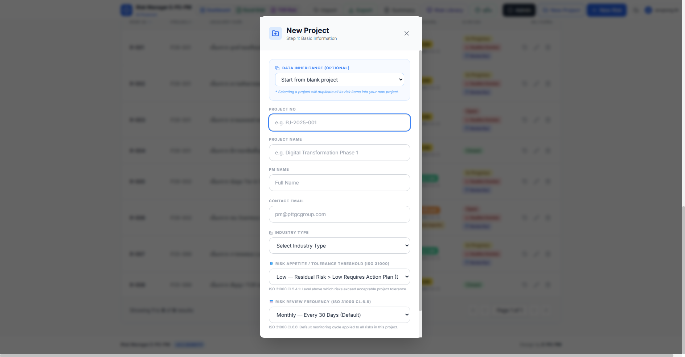
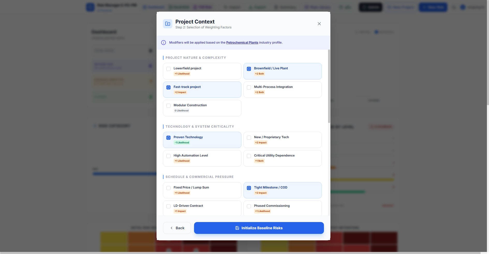

<!-- _class: lead -->

  USER QUICK START GUIDE • 2026 EDITION
  <h1 style="font-size: 2.2rem; margin-top: 15px; color: #0f2c59; font-weight: 800;">
    Smart Risk Management
  </h1>
  

    คู่มือแนะนำการใช้งานระบบบริหารความเสี่ยงโครงการ EPC อัจฉริยะ 
    รวดเร็ว • ใช้งานง่าย • แม่นยำตามมาตรฐาน ISO 31000 & COSO ERM
  

  

    🌐 URL: www.gcmeapp.com/epopm
    🤖 Gemini 3.7 Flash & Llama 3
  

---

# 1. ภาพรวมระบบ (System Architecture)
## ศูนย์กลางการบริหารความเสี่ยงโครงการครอบคลุมทั้งวงจร 4 เสาหลัก

  

    MODULE 1
    <h3 style="margin-top: 4px; color: #0f2c59;">📊 Dashboard & Matrix</h3>
    
• <strong>5x5 Heatmap:</strong> แสดงความเสี่ยง Initial vs Residual 
    • <strong>Dynamic Filter:</strong> กรองเฉพาะโครงการหรือดูทั้งบริษัท 
    • <strong>Visual Charts:</strong> กราฟแยกหมวดหมู่และสถานะโครงการ

  

  

    MODULE 2
    <h3 style="margin-top: 4px; color: #15803d;">📑 Excel Register Grid</h3>
    
• <strong>Inline Editing:</strong> พิมพ์แก้ไขในตารางรวดเร็วเหมือน Excel 
    • <strong>Header Guides:</strong> ชี้ดูคำอธิบายตามเกณฑ์ EPM-03-014 
    • <strong>Unsaved Shield:</strong> ข้อมูลไม่สูญหายแม้มี Real-time sync

  

  

    MODULE 3
    <h3 style="margin-top: 4px; color: #7e22ce;">🤖 TOR AI Assessment</h3>
    
• <strong>Scan TOR Docs:</strong> อัปโหลด PDF/Word วิเคราะห์ทันที 
    • <strong>สกัดค่าปรับ LDs:</strong> ตรวจพบบทลงโทษสัญญา 
    • <strong>EMV Buffer:</strong> คำนวณงบสำรองความเสี่ยงก่อนยื่นซอง

  

  

    MODULE 4
    <h3 style="margin-top: 4px; color: #b45309;">✉️ Alerts & Export</h3>
    
• <strong>Overdue Alert:</strong> ส่งอีเมลแจ้งเตือนความเสี่ยงเลยกำหนด 
    • <strong>Official Excel:</strong> ออกรายงาน Template EPM-03-014AT1 
    • <strong>SQL Backup:</strong> สำรองฐานข้อมูลลง PostgreSQL / MySQL

  

  

    💡 <strong>จุดเด่นสำคัญ:</strong> ปรับปรุงความเร็วโหลดด้วย Code Splitting, รองรับ Microsoft SSO Login, ใช้งานได้ทั้งบน PC, Tablet และ Mobile
  

---

# 2. การเข้าสู่ระบบและสิทธิ์การใช้งาน (Login & Roles)
## เข้าใช้งานสะดวกรวดเร็วผ่าน Web Browser ปลอดภัยระดับองค์กร

  

    <h3 style="color: #0f2c59;">🔐 ขั้นตอนการเข้าใช้งาน</h3>
    <ul>
      <li><strong>เข้าสู่ระบบ:</strong> ไปที่ <a href="https://www.gcmeapp.com/epopm">www.gcmeapp.com/epopm</a></li>
      <li><strong>ช่องทาง Login:</strong>
        <ul>
          <li><strong>Email & Password:</strong> กรอกอีเมลบริษัทและรหัสผ่าน</li>
          <li><strong>Sign in with Microsoft:</strong> ล็อกอินด้วยบัญชีองค์กร 1-Click</li>
        </ul>
      </li>
      <li><strong>รหัสผ่านเริ่มต้น:</strong> ผู้ใช้ใหม่ใช้ <code>gcme1234567</code> (บังคับเปลี่ยนครั้งแรก)</li>
      <li><strong>Theme:</strong> สลับ Dark Mode / Light Mode ได้อิสระที่มุมขวาบน</li>
      <li><strong>User Account:</strong> ตรวจสอบสิทธิ์และเปลี่ยนรหัสผ่านได้ตลอดเวลา</li>
    </ul>
  

  

    <h3 style="color: #92400e;">👥 ระดับสิทธิ์ผู้ใช้งาน (Roles & Permissions)</h3>
    

      Admin (ผู้ดูแลระบบกลาง)
      
เห็นทุกโครงการ, เพิ่ม/ลบผู้ใช้, กำหนดสิทธิ์ Project Assignment, จัดการ Baseline และดาวน์โหลด Database Backup

    

    

      Project Manager / User
      
เข้าถึงและแก้ไขเฉพาะโครงการที่ตนเองได้รับมอบหมาย (Assigned Projects)

    

    

      

        ⚠️ <strong>หากขึ้น "Permission Denied":</strong> แสดงว่ายังไม่ได้รับ Assign โครงการ ให้แจ้ง Admin เพื่อเพิ่ม Project Number ในสิทธิ์ของผู้ใช้
      

    

  

---

# 3. เริ่มต้นโครงการใหม่ (Project Setup - Step 1)
## สร้างโครงการพร้อมเชื่อมโยงรหัส ERP และมาตรฐาน ISO 31000

  

    <h3 style="color: #0f2c59;">➕ ขั้นตอนการสร้างโครงการใหม่ (Step 1)</h3>
    <ol>
      <li>คลิกปุ่ม <strong>"New Project" (📁+)</strong> บนแถบ Navbar ด้านบน</li>
      <li><strong>Data Inheritance:</strong> เลือก Clone ความเสี่ยงจากโครงการเดิม หรือเริ่มจาก Blank</li>
      <li>กรอก <strong>Project Number</strong> (เช่น <code>PJ-2025-001</code>) ให้ตรงกับรหัส ERP</li>
      <li>ระบุ <strong>PM Name & Contact Email</strong> สำหรับรับการแจ้งเตือน Overdue Task</li>
      <li>เลือกประเภทอุตสาหกรรม (Power Plant, Petrochemical, Infrastructure)</li>
      <li>กำหนด <strong>Risk Appetite</strong> และ Review Frequency ตาม ISO 31000</li>
      <li>คลิกปุ่ม <strong>"Next →"</strong> สีน้ำเงิน เพื่อเข้าสู่ขั้นตอนถ่วงน้ำหนักใน Step 2</li>
    </ol>
    

      

        💡 <strong>Pro-Tip:</strong> ตั้งชื่อ Project No ให้ตรงกับ ERP เพื่อการวิเคราะห์ข้ามระบบอย่างไร้รอยต่อ
      

    

  

  

    

      ●●●
      📁 New Project Setup • Step 1: Basic Information
    

    
    

      

        📋 <strong>ข้อมูลโครงการ:</strong> ระบุ Project No, Industry Type, ISO 31000 Thresholds แล้วกด Next เข้าสู่ Step 2
      

    

  

---

# 4. บริบทโครงการ & การถ่วงน้ำหนัก (Weighting Factors - Step 2)
## ปรับจูนคะแนนความเสี่ยงให้ตรงกับสภาพจริงของโครงการด้วยโมเดล 7 หมวดหมู่

  

    <h3 style="color: #6b21a8;">⚙️ เกณฑ์การเลือก Weighting Factors (7 หมวดหมู่)</h3>
    <ol style="font-size: 0.72rem; line-height: 1.35; margin: 0; padding-left: 18px;">
      <li><strong>Project Nature:</strong> ติ๊ก <em>Brownfield / Live Plant</em> หากทำในโรงงานเดิม (+2 Both), หรือ <em>Fast-track</em> (+2 Impact)</li>
      <li><strong>Technology & Criticality:</strong> หากใช้ <em>Proven Tech</em> จะได้แต้มลด (-1 Likelihood), หากเป็น <em>New Tech</em> (+2 Impact)</li>
      <li><strong>Commercial Pressure:</strong> ติ๊ก <em>Fixed Price / Lump Sum</em>, <em>Tight Milestone / COD</em> (+2 Impact), หรือสัญญาที่มี <em>LD Penalty</em></li>
      <li><strong>Location & Environment:</strong> ไซต์งานห่างไกล <em>Remote / Offshore</em> หรือสภาพอากาศสุดขั้ว <em>Extreme Climate</em></li>
      <li><strong>Supply Chain:</strong> มีเครื่องจักรนำเข้านาน <em>Long Lead Equipment</em> (+Both) หรือใช้วัสดุผูกขาด <em>Single Source</em></li>
      <li><strong>Workforce & Site:</strong> ขาดแคลนช่างเฉพาะทาง <em>Skilled Labor Shortage</em> หรือหน้างานแออัด <em>Congested Site</em></li>
      <li><strong>Commissioning:</strong> ลำดับสตาร์ตรันระบบซับซ้อน <em>Complex Start-up</em> หรือพึ่งพา <em>Critical Utility</em></li>
    </ol>
    

      

        🎯 <strong>หลักการคำนวณ:</strong> นำคะแนนฐาน + Modifiers ที่เลือก (Clamped 1-5) เพื่อสร้าง 31 Baseline Risks ที่สะท้อนความจริง
      

    

  

  

    

      ●●●
      ⚙️ Project Context • Step 2: Selection of Weighting Factors
    

    
    

      

        ⚡ <strong>Industry Modifiers:</strong> ค่า Impact/Likelihood ถูกปรับแต่งตามประเภทโรงงาน คลิก <strong>"Initialize Baseline Risks"</strong> ทันที
      

    

  

---

# 5. การจัดการรายการความเสี่ยง (Risk Management)
## บันทึกและประเมินระดับความเสี่ยงตามมาตรฐาน 5x5 Heatmap Matrix

  

    <h4 style="color: #0f2c59;">1 บันทึกความเสี่ยง (Identification)</h4>
    <ul>
      <li><strong>Category:</strong> เลือกหมวดหมู่งาน (Eng, Procure, Const, SHE)</li>
      <li><strong>Description (ISO 31000):</strong> 
        <em>"เนื่องจาก [สาเหตุ] จึงเสี่ยงต่อ [เหตุการณ์] ส่งผลให้ [ผลกระทบ]"</em></li>
      <li><strong>Possible Effect:</strong> Cost (C), Time (T), Quality (Q), HSE, Reputation (R)</li>
    </ul>
  

  

    <h4 style="color: #92400e;">2 ประเมินคะแนน 5x5 Matrix</h4>
    <ul>
      <li><strong>Impact (1-5):</strong> Insignificant &rarr; Severe</li>
      <li><strong>Likelihood (1-5):</strong> Rarely &rarr; Most Likely</li>
      <li><strong>Initial Score:</strong> คะแนนก่อนมีมาตรการ (1-25)</li>
      <li><strong>Residual Score:</strong> คะแนนคงเหลือหลังมีมาตรการ</li>
      <li><strong>ระดับความเสี่ยง:</strong> Low (เขียว), Medium (เหลือง), High (ส้ม), Very High (แดง)</li>
    </ul>
  

  

    <h4 style="color: #15803d;">3 มาตรการควบคุม (Treatment)</h4>
    <ul>
      <li><strong>กลยุทธ์ 4 รูปแบบ:</strong>
         <strong>A</strong> = Avoid (หลีกเลี่ยง/ขจัด)
         <strong>T</strong> = Transfer (ถ่ายโอน/ประกัน)
         <strong>M</strong> = Mitigate (บรรเทาผลกระทบ)
         <strong>AC</strong> = Accept (ยอมรับความเสี่ยงต่ำ)</li>
      <li><strong>Action Plan:</strong> แผนงานที่ชัดเจน</li>
      <li><strong>Owner & Date:</strong> ผู้รับผิดชอบและวันแล้วเสร็จ</li>
    </ul>
  

---

# 6. ตัวช่วยอัจฉริยะ AI Suggest (Risk Copilot)
## แนะนำกลยุทธ์การรับมือความเสี่ยงและแผนดำเนินการใน 3 วินาที

  

    <h3 style="color: #6b21a8;">✨ วิธีใช้งานปุ่ม "AI Suggest"</h3>
    <ol>
      <li>ขณะกรอก Risk Form ให้ระบุ Description และคะแนนเบื้องต้น</li>
      <li>คลิกปุ่ม <strong>"AI Suggest" (✨)</strong> สีม่วงด้านขวาของฟอร์ม</li>
      <li>AI ประมวลผลจากคลังความเชี่ยวชาญด้าน EPC Project Management</li>
      <li>ระบบสรุป <strong>กลยุทธ์ที่เหมาะสมที่สุด</strong> (A/T/M/AC) พร้อม <strong>Action to Control</strong> ภาษาไทยอย่างเป็นรูปธรรม</li>
      <li>ระบุทั้งสิ่งที่ต้องทำ, ผู้รับผิดชอบ และเกณฑ์วัดความสำเร็จ</li>
      <li>คลิกนำข้อความมาปรับใช้ในฟอร์มได้ทันที</li>
    </ol>
  

  

    <h3 style="color: #0f2c59;">⚙️ ขุมพลังและการรักษาความปลอดภัย</h3>
    <ul>
      <li><strong>Dual-Engine AI:</strong> ขับเคลื่อนด้วย Google Gemini 3.7 Flash และ Groq Llama 3.3 70B ตอบกลับรวดเร็วทันใจ</li>
      <li><strong>Data Privacy:</strong> ข้อมูลโครงการไม่ถูกนำไปเทรนโมเดลภายนอก</li>
      <li><strong>Custom API Key:</strong> สามารถระบุ Gemini API Key ส่วนตัวได้ในหน้า AI Setting เพื่อความคล่องตัวสูงสุด</li>
      <li><strong>ISO 31000 Alignment:</strong> แผนงานที่ AI แนะนำสอดคล้องกับกรอบบริหารความเสี่ยงระดับสากล</li>
    </ul>
  

---

# 7. โหมดแก้ไขตารางด่วน Excel Grid View
## จัดการความเสี่ยงหลายสิบรายการพร้อมกันอย่างรวดเร็วเหมือนโปรแกรม Excel

  

    <h4 style="color: #15803d;">⚡ Inline Grid Editing</h4>
    <ul>
      <li>สลับเข้าโหมด <strong>"Excel Grid"</strong> ได้ทันทีจาก Navbar</li>
      <li>คลิกแก้ไข Description, Owner, หรือเปลี่ยนสถานะ Open / Closed ได้ทันทีในตาราง</li>
      <li>ปรับคะแนน Impact / Likelihood ในเซลล์ได้เลย โดยไม่ต้องเปิด Modal ทีละรายการ</li>
      <li>ค้นหา (Search) และคลิกหัวคอลัมน์เพื่อ Sort ลำดับข้อมูล</li>
    </ul>
  

  

    <h4 style="color: #0f2c59;">💡 Hover Header Guides</h4>
    <ul>
      <li>ชี้เมาส์ที่หัวคอลัมน์ใดๆ จะปรากฏ Tooltip อธิบายข้อกำหนดตามคู่มือ <strong>EPM-03-014 Rev F3</strong></li>
      <li>แนะนำโครงสร้างข้อความ ISO 31000 และเกณฑ์คะแนนผลกระทบ Cost & Time</li>
      <li>ช่วยให้วิศวกรใหม่บันทึกข้อมูลได้อย่างถูกต้องทันที</li>
    </ul>
  

  

    <h4 style="color: #92400e;">🛡️ Safe Batch & Unsaved Shield</h4>
    <ul>
      <li><strong>Duplicate Row (📋):</strong> โคลนแถวที่คล้ายกันเพื่อปรับแก้ต่อ</li>
      <li><strong>Add Row (+):</strong> เพิ่มแถวใหม่อย่างต่อเนื่อง</li>
      <li><strong>Batch Save:</strong> ไฮไลต์แถวที่แก้ไข (Dirty Rows) และบันทึกลงฐานข้อมูลทีเดียว</li>
      <li><strong>Unsaved Shield:</strong> แถวที่กำลังพิมพ์อยู่จะไม่ถูกเขียนทับจาก Real-time sync เด็ดขาด</li>
    </ul>
  

---

# 8. โมดูลวิเคราะห์ TOR & Proposal Risk Assessment
## ป้องกันความเสี่ยงขาดทุนตั้งแต่ขั้นตอนจัดทำข้อเสนอประกวดราคา

  

    <h3 style="color: #6b21a8;">📑 การวิเคราะห์เอกสาร TOR</h3>
    <ul>
      <li>แนบไฟล์ TOR ได้ทั้ง PDF และ Word (.docx) ระบบดึงข้อความอัตโนมัติ</li>
      <li>AI สกัดเงื่อนไขสัญญาสำคัญ (Constraints) และ <strong>บทปรับส่งมอบงานล่าช้า (Liquidated Damages: LDs เช่น 0.1%/วัน)</strong></li>
      <li>จำแนกความเสี่ยงอัตโนมัติ 8 มิติ: Strategic, Operational, Financial, Compliance, Technology, Resource, Reputational, Schedule</li>
      <li>ประเมินมูลค่าความเสียหายคาดการณ์ (Estimated Impact Cost)</li>
    </ul>
  

  

    <h3 style="color: #0f2c59;">🏛️ ประโยชน์สำหรับคณะกรรมการเสนอราคา</h3>
    <ul>
      <li><strong>คำนวณงบสำรองความเสี่ยง EMV:</strong>
         <code>EMV = Probability (%) × Estimated Impact Cost (THB)</code>
         รวมเป็น <strong>Contingency Buffer</strong> ที่ต้องบวกเพิ่มในราคาขาย</li>
      <li><strong>แนะนำ Qualification Clause:</strong> ข้อสงวนสิทธิ์ยื่นแนบในซองราคา เช่น ขอขยายเวลากรณีส่งมอบพื้นที่ล่าช้า</li>
      <li><strong>1-Click PDF Report:</strong> พิมพ์รายงานสรุปพร้อมพื้นที่เซ็นชื่อ Preparer / Reviewer / Approver เข้าที่ประชุมบอร์ดได้ทันที</li>
    </ul>
  

---

# 9. การติดตามสถานะและการแจ้งเตือน (Monitoring & Alerts)
## ติดตามรอบทบทวนความเสี่ยง และแจ้งเตือนรายการที่เกินกำหนด (Overdue)

  

    <h4 style="color: #92400e;">⏰ Next Review & Overdue</h4>
    <ul>
      <li>ตามเกณฑ์ ISO 31000 Cl.6.6 ระบบคำนวณวันนัดทบทวนถัดไปให้อัตโนมัติ (Monthly 30 วัน, Quarterly 90 วัน)</li>
      <li>รายการที่เลยกำหนดจะแสดงสถานะ <strong>Overdue (สีแดง)</strong> บน Dashboard ทันที</li>
      <li>มีกราฟ Overdue Risk Chart แสดงสัดส่วนความเสี่ยงเกินกำหนด</li>
    </ul>
  

  

    <h4 style="color: #0f2c59;">📧 Email Alert Notification</h4>
    <ul>
      <li>สรุปรายการความเสี่ยงเกินกำหนดแยกรายโครงการและราย PM</li>
      <li><strong>1-Click Dispatch:</strong> เปิดโปรแกรม Outlook/Mail พร้อมสร้างเนื้อหาอีเมลให้อัตโนมัติ</li>
      <li><strong>Copy Template:</strong> คัดลอกข้อความสรุปส่งต่อใน Teams หรือ Line ได้ในคลิกเดียว</li>
    </ul>
  

  

    <h4 style="color: #15803d;">📊 Official Export & Backup</h4>
    <ul>
      <li><strong>Export Excel ทางการ:</strong> ส่งออกลงใน Template <strong>EPM-03-014AT1</strong> พร้อมสี Matrix</li>
      <li><strong>Client Fallback:</strong> ดาวน์โหลดได้ตลอดเวลาแม้ Server ออฟไลน์</li>
      <li><strong>1-Click SQL Dump:</strong> สำรองฐานข้อมูลลง PostgreSQL / MySQL ได้ทันที</li>
    </ul>
  

---

# 10. สรุป Checklist ประจำสัปดาห์สำหรับ PM (Weekly Routine)
## ขั้นตอนง่ายๆ ใน 5 นาที เพื่อให้ข้อมูลความเสี่ยงของโครงการอัปเดตอยู่เสมอ

  

    <h3 style="color: #0f2c59;">📋 Weekly 4-Step Routine สำหรับ PM</h3>
    

      1 <strong>ตรวจสอบ Dashboard:</strong> กรองเฉพาะโครงการของตนเอง เช็คความเสี่ยง High / Very High
    

    

      2 <strong>เคลียร์รายการ Overdue:</strong> ตรวจสอบรายการที่เลยกำหนด ขยายเวลาหรืออัปเดตงาน
    

    

      3 <strong>อัปเดตใน Excel Grid:</strong> บันทึกความคืบหน้า Action to Control และบันทึกทีเดียว
    

    

      4 <strong>ปิดความเสี่ยงที่สำเร็จ:</strong> เปลี่ยน Status เป็น 'Closed' เพื่อลดความเสี่ยงคงเหลือ
    

  

  

    <h3 style="color: #15803d;">📞 ช่องทางสนับสนุนและติดต่อช่วยเหลือ</h3>
    <ul>
      <li><strong>เว็บแอปพลิเคชัน:</strong> <a href="https://www.gcmeapp.com/epopm">www.gcmeapp.com/epopm</a></li>
      <li><strong>คู่มือออนไลน์:</strong> กดปุ่ม "Risk Guide / คู่มือ" บน Navbar เพื่ออ่านคู่มือแบบละเอียด</li>
      <li><strong>ขอสิทธิ์เข้าถึงโครงการ:</strong> ติดต่อ Admin ทีมงาน E-PO-PM</li>
      <li><strong>สรุปหัวใจสำคัญ:</strong> <em>"การบันทึกสม่ำเสมอ คือเกราะป้องกันต้นทุนบานปลาย และทำให้โครงการส่งมอบสำเร็จตามเป้าหมาย"</em></li>
    </ul>
  

