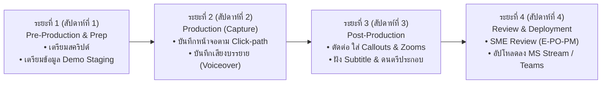

# แผนการดำเนินงานและมาตรฐานการผลิตวิดีโอ (Video Production Plan)

เอกสารนี้ระบุรายละเอียดขั้นตอนการผลิต ทรัพยากร เครื่องมือ แผนการทดสอบ และขั้นตอนการตรวจสอบคุณภาพ (QA) สำหรับการจัดทำวิดีโออบรมพนักงานระบบ **Smart Risk Management**

---

## 1. กรอบระยะเวลาและขั้นตอนการดำเนินงาน (Production Timeline)

โครงการผลิตวิดีโอแบ่งออกเป็น 4 ระยะหลัก (ระยะเวลารวมประมาณ 3–4 สัปดาห์):

### ตารางกิจกรรมและผลลัพธ์ (Deliverables Milestone)

| สัปดาห์ | กิจกรรมหลัก (Key Activities) | ผลลัพธ์ที่ต้องส่งมอบ (Deliverables) | ผู้รับผิดชอบ |
| :---: | :--- | :--- | :--- |
| **สัปดาห์ที่ 1** | • ตรวจทานและอนุมัติสคริปต์ในเอกสาร `03_Storyboards_and_Scripts.md` • ตั้งค่าระบบ Demo Environment และสร้างข้อมูลตัวอย่างตาม `04_Demo_Data_and_Screen_Recording_Guide.md` | • สคริปต์ Final ที่ได้รับการอนุมัติ • บัญชี Demo พร้อมโครงการทดสอบ | • Lead PM (E-PO-PM) • ทีมผู้ผลิตสื่อ |
| **สัปดาห์ที่ 2** | • ดำเนินการอัดบันทึกหน้าจอ (Screen Recording) ทีละตอนตาม Click-path • บันทึกเสียงพากย์ภาษาไทย (Voiceover) ตามบทพากย์คำต่อคำ | • ไฟล์วิดีโอดิบ (Raw Screen Captures) • ไฟล์เสียงพากย์แยกตอน (WAV Audio Tracks) | • Screen Capturer • ผู้ให้เสียงพากย์ / Voice Artist |
| **สัปดาห์ที่ 3** | • ตัดต่อประกอบภาพและเสียง (Editing & Sync) • ใส่ Effect ซูมขยายจุดคลิก, แอนิเมชันลูกศร, แถบ Callout ข้อความเน้นย้ำ • ใส่เพลงประกอบเบาๆ (Background Music) และสร้าง Subtitle ภาษาไทย | • วิดีโอดราฟท์แรก (Draft 1.0) ทั้ง 9 ตอน (MP4 1080p) พร้อมไฟล์ Subtitle (.srt) | • Video Editor |
| **สัปดาห์ที่ 4** | • ฝ่าย E-PO-PM ตรวจความถูกต้องของเนื้อหาเชิงเทคนิคและมาตรฐาน ISO 31000 • ปรับแก้ตามข้อเสนอแนะ และเรนเดอร์เวอร์ชันสมบูรณ์ (Final Cut) • จัดทำ Master Full Course (ตอนเดียวจบ 30 นาที) และแยกตอนย่อย 9 คลิป • เผยแพร่ลง Microsoft Stream, Microsoft Teams และระบบ E-Learning | • วิดีโอ Master Final MP4 ครบทั้ง 9 ตอน และ Master Edition • ลิงก์เผยแพร่บนระบบ Intranet ของบริษัท | • E-PO-PM Reviewer • IT / Learning Admin |

---

## 2. ทีมงานและบทบาทหน้าที่ (Roles & Responsibilities)

1. **Subject Matter Expert (SME) - ทีม E-PO-PM:**
   - ตรวจสอบความถูกต้องของศัพท์วิศวกรรม, มาตรฐาน ISO 31000, แบบฟอร์ม EPM-03-014AT1, และการคำนวณ EMV
   - ตรวจความถูกต้องของการสาธิตระบบ
2. **Screen Presenter / Capturer:**
   - บันทึกการใช้งานจริงบนเบราว์เซอร์อย่างลื่นไหล เมาส์เคลื่อนที่นุ่มนวล ไม่สั่นไหว คลิกตรงจังหวะ
3. **Voiceover Artist / Audio Engineer:**
   - บันทึกเสียงบรรยายภาษาไทยทางการ น้ำเสียงกระฉับกระเฉง ชัดถ้อยชัดคำ เน้นย้ำคำสำคัญ
   - ปรับแต่งเสียง (De-noise, Compression, Normalization) ให้ได้มาตรฐานความดัง
4. **Motion Graphic & Video Editor:**
   - ตัดต่อ จัดจังหวะภาพให้สอดคล้องกับเสียงบรรยาย
   - เพิ่ม Lower Thirds, Spotlight Highlights, Zooms และสไลด์เปิด/ปิดหัวข้อ
5. **Quality Assurance (QA) & Publication Admin:**
   - ตรวจสอบความถูกต้องรอบสุดท้าย และจัดการอัปโหลดพร้อมตั้งค่า Chapter Marker ใน MS Stream

---

## 3. สเปกทางเทคนิคและอุปกรณ์ที่แนะนำ (Technical Specifications)

### 3.1 การตั้งค่าหน้าจอและซอฟต์แวร์บันทึก (Screen Recording Setup)
- **เครื่องมือบันทึก:** OBS Studio, Camtasia, หรือ DaVinci Resolve Screen Capture
- **ความละเอียดหน้าจอ:** 1920 × 1080 (16:9 Widescreen) อัตราสเกล Windows: 100%
- **เบราว์เซอร์:** Google Chrome หรือ Microsoft Edge ในโหมด Fullscreen (กด `F11`) เพื่อซ่อน Tab Bar และ Bookmarks ที่ไม่จำเป็น
- **ความสะอาดของหน้าจอ:** ซ่อน Taskbar, ปิดการแจ้งเตือนของ Windows และ Teams ทั้งหมดระหว่างบันทึก
- **การเคลื่อนไหวของเมาส์:** เปิดใช้งานตัวแสดงวงกลมสีรอบเคอร์เซอร์ (Mouse Highlighter) สีเหลืองโปร่งแสง ขนาดพอเหมาะ เพื่อให้ผู้ชมติดตามการคลิกได้ชัดเจน

### 3.2 การตั้งค่าเสียง (Audio Setup & Guidelines)
- **ความถี่และบิตเรต:** 48 kHz, 24-bit PCM (WAV) สำหรับไฟล์ต้นฉบับ
- **ความดังมาตรฐาน:** ระดับเสียงพากย์หลักอยู่ที่ **-14 LUFS** (Peak ไม่เกิน -1.0 dBFS)
- **เพลงประกอบ (Background Music):** ดนตรีสไตล์ Corporate / Tech / Uplifting ระดับความดังเพลงให้อยู่ที่ **-28 ถึง -32 LUFS** (เพื่อไม่ให้กลบเสียงผู้บรรยาย)
- **การออกเสียงคำศัพท์เทคนิค:**
  - *SSO* ออกเสียงว่า "เอส-เอส-โอ" (Single Sign-On)
  - *TOR* ออกเสียงว่า "ที-โอ-อาร์" (Terms of Reference)
  - *LDs* ออกเสียงว่า "แอล-ดี" หรือ "ลิควิดเดต เดมเมจ" (ค่าปรับส่งมอบล่าช้า)
  - *EMV* ออกเสียงว่า "อี-เอ็ม-วี" (Expected Monetary Value)
  - *Initial vs Residual* ออกเสียงว่า "อินิเชียล" (ก่อนมีมาตรการ) และ "เรซิดูอัล" (หลังมีมาตรการ)

### 3.3 องค์ประกอบภาพและแอนิเมชัน (Visual & Branding Assets)
- **ชุดสีองค์กร (Brand Color Palette):**
  - Navy Corporate: `#0F172A` และ `#1E3A8A`
  - Accent Blue: `#3B82F6` (ปุ่ม New Project, Next)
  - Purple AI: `#8B5CF6` / `#7C3AED` (ปุ่ม `✨ AI Suggest`)
  - Status Colors (Matrix): เขียว `#10B981`, เหลือง `#F59E0B`, ส้ม `#F97316`, แดง `#EF4444`
- **Typo & Font:** ฟอนต์ภาษาไทยไม่มีหัวสไตล์โมเดิร์น เช่น *Prompt*, *Noto Sans Thai*, หรือ *IBM Plex Sans Thai*

---

## 4. รายการตรวจสอบคุณภาพก่อนส่งมอบ (QA Checklist)

ก่อนส่งมอบไฟล์วิดีโอตัวสมบูรณ์ ให้ตรวจสอบรายการดังต่อไปนี้:

- [ ] **ความถูกต้องของขั้นตอน (Accuracy):** ขั้นตอนการกดคลิกในระบบตรงตามที่ระบุในสไลด์และฟังก์ชันปัจจุบันของระบบ v0.2.20260717
- [ ] **การแสดงผลข้อมูลชั้นความลับ (Data Privacy):** ไม่มีชื่อโครงการจริงที่เป็นความลับทางการค้า, ไม่มีรหัสผ่าน หรือ Token ปรากฏบนหน้าจอ (ใช้ข้อมูลจำลองตาม `04_Demo_Data_and_Screen_Recording_Guide.md` ทั้งหมด)
- [ ] **ความคมชัดและสัดส่วนภาพ (Visual Clarity):** วิดีโอมีความคมชัด 1080p ไม่เบลอ ตัวอักษรในฟอร์มตารางอ่านง่ายเมื่อถูกซูม
- [ ] **เสียงพากย์และดนตรี (Audio Balance):** เสียงพูดดังสม่ำเสมอ ไม่มีเสียงรบกวน (Noise/Echo) และดนตรีเบาลงอย่างนุ่มนวล (Audio Ducking) เมื่อมีเสียงพูด
- [ ] **ซับไตเติล (Subtitles):** ข้อความคำบรรยายสะกดถูกต้องตรงตามคำพูด และขึ้นตรงจังหวะ (Sync 100%)
- [ ] **Export Template (Verification):** สาธิตการส่งออกไฟล์ Excel ที่เปิดออกมาแล้วแสดงฟอร์ม `EPM-03-014AT1` พร้อมสี Badge เมทริกซ์ถูกต้อง

---

## 5. ช่องทางการเผยแพร่และการนำไปใช้งาน (Deployment Strategy)

1. **Microsoft Stream on SharePoint:**
   - อัปโหลดใน Channel: `GCME Project Management Excellence / ProRisk AI Training`
   - เพิ่ม Chapters แบ่งตาม 9 ตอน และแนบไฟล์เอกสารคู่มือ PDF ใต้คลิป
2. **Microsoft Teams:**
   - ปักหมุดแท็บ (Tab) ในห้อง Teams `E-PO-PM Community` และห้อง PM รายโครงการ
3. **ระบบฝึกอบรมขององค์กร (Corporate LMS):**
   - บรรจุเป็นหลักสูตรบังคับเรียน (Mandatory E-Learning) สำหรับ PM และ PE ที่ได้รับการแต่งตั้งใหม่
   - จัดทำแบบทดสอบความเข้าใจสั้นๆ (Quiz 5 ข้อ) หลังเรียนจบ เพื่อรับ Digital Certificate
4. **ปุ่ม Help ในระบบ Smart Risk Management:**
   - ฝังลิงก์วิดีโอแต่ละตอนลงใน Modal หรือปุ่ม Help ของหน้านั้นๆ เพื่อให้ผู้ใช้เปิดดูวิธีทำเฉพาะจุดได้ทันที (Contextual Microlearning)
